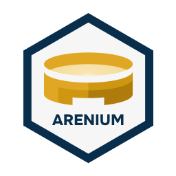

<div align="center">



# Arenium

[](https://github.com/nostr-protocol/nostr)
[](https://svelte.dev/)
[](https://tailwindcss.com/)
[](https://www.postgresql.org/)
[](https://www.docker.com/)

<i>Governance as a Service</i>

</div>

## Description

A decentralized governance system based on [Nostr Protocol](https://github.com/nostr-protocol/nostr). Each user has their own cryptographic identity (a public/private key pair), and data travels across a network of independent relays. Host your own relay or connect to public ones.

## Supported NIPs

| NIP | Description |
|-----|-----------|
| NIP-01 | Basic protocol |
| NIP-04 | Encrypted direct messages |
| NIP-05 | Identity verification via DNS |
| NIP-07 | Signing via browser extension |
| NIP-19 | Bech32 identifiers (npub, nsec, note) |
| NIP-29 | Relay-based Groups |
| NIP-88 | Polls |

## Instructions


### Hosting a Dedicated Relay

Make sure to have Docker installed

### Installation

Clone the repository:

```bash
git clone https://github.com/Org-de-Desenvolvimento-do-Sul-Global/Arenium.git
cd Arenium
```

Install the dependencies:

```bash
npm install
```

Configure the necessary environment variables in the `.env` file:

```env
DATABASE_URL=<postgresql-connection-string>
```

Configure the PostgreSQL database as needed.

### Execution

Start the development server:

```bash
npm run dev
```

### Build

To generate a production build:

```bash
npm run build
```

To run the built version:

```bash
npm run preview
```

## How to contribute

Contributions are welcome! To contribute:

1. Fork the project
2. Create a feature branch (git checkout -b feature/new-feature)
3. Commit your changes (git commit -m 'Add new feature')
4. Push to the remote repository (git push origin feature/new-feature)
5. Open a Pull Request

## Reporting bugs

Found a bug? Open an issue describing:

- The expected behavior
- The actual behavior
- Steps to reproduce

## License

This project is licenced under the terms of _ License.

Head over to [`LICENSE`](LICENSE) to obtain the full text of the licence.
